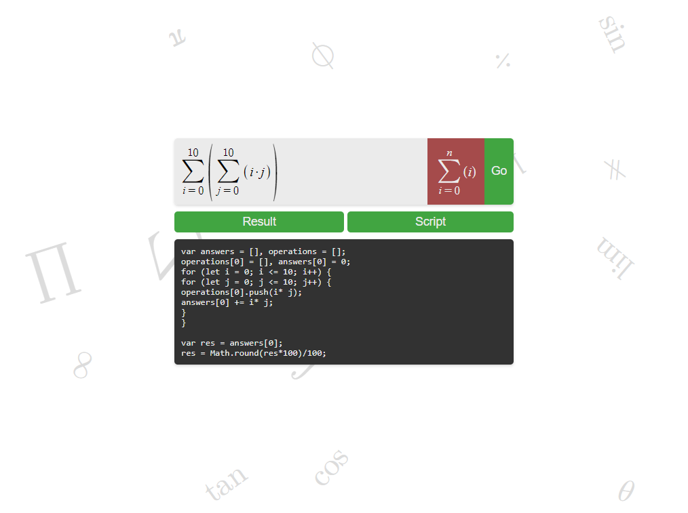
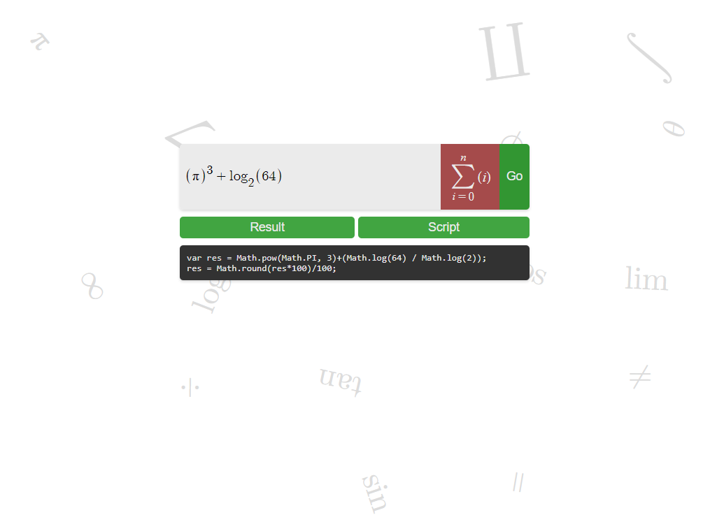

A calculator built in React with key emphasis on summations

This app...
- Parses a LateX string using regex
- Generates a script which holds the mathematical result
- Randomly generates a background of math symbols every reload

Prerequisites:
1. npm `npm install npm@latest -g`
2. serve `npm install serve`

Installation:
1. `git clone https://github.com/zzzelchy/calculator/tree/main/build`
2. `serve -s` in the root directory

Some screenshots...

